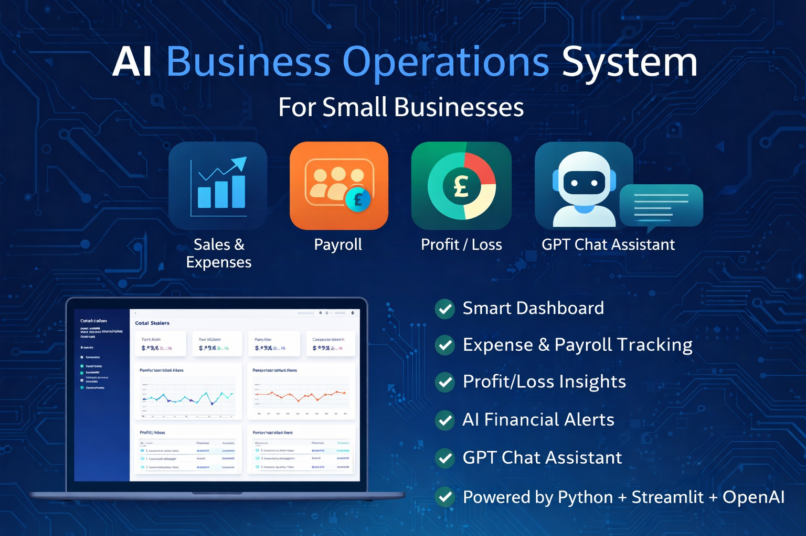
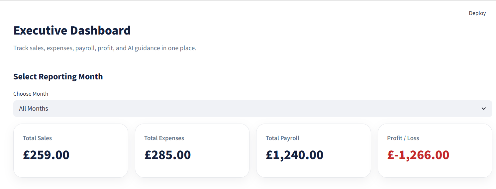
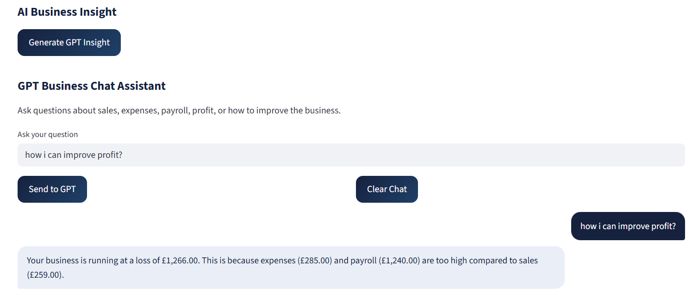
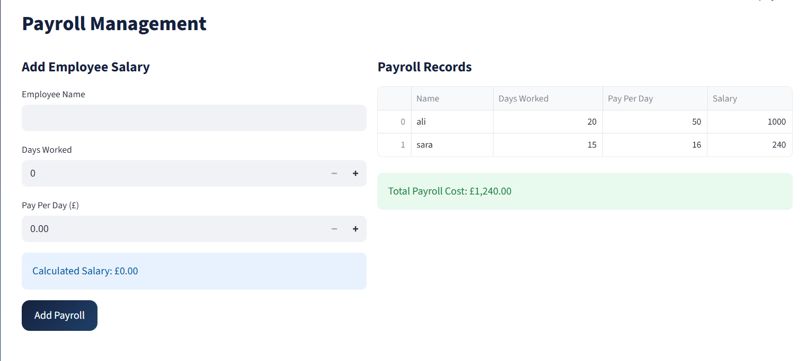

<p align="center">
  
</p>

<h1 align="center">AI Business Operations System</h1>

<p align="center">
AI-powered dashboard for managing sales, expenses, payroll, profit/loss, and business insights
</p>

<p align="center">
  
  
  
  
</p>

<p align="center">
  <a href="#">
    
  </a>
</p>

---

## Project Overview

The **AI Business Operations System** is a real-world business dashboard designed for small businesses to manage financial operations and gain intelligent insights.

It combines **data tracking, analytics, and AI** into a single system to support better business decision-making.

> ⚡ This project combines business analytics, automation, and AI to solve real-world small business problems.

---

## Key Features

- Sales tracking and management  
- Expense tracking and categorisation  
- Payroll management and salary calculation  
- Automatic profit and loss calculation  
- Smart business alerts  
- AI-generated business insights  
- GPT-powered business chatbot  
- Interactive dashboard with charts and filters  

---

## Screenshots

### Dashboard Overview
<p align="center">
  
</p>

### AI Chat Assistant
<p align="center">
  
</p>

### Payroll Management
<p align="center">
  
</p>

## Project Overview

The **AI Business Operations System** is a real-world business dashboard designed for small businesses to manage financial operations and gain intelligent insights.

It combines **data tracking, analytics, and AI** into a single system to support better business decision-making.

> ⚡ This project combines business analytics, automation, and AI to solve real-world small business problems.

---

## Key Features

- Sales tracking and management  
- Expense tracking and categorisation  
- Payroll management and salary calculation  
- Automatic profit and loss calculation  
- Smart business alerts  
- AI-generated business insights  
- GPT-powered business chatbot  
- Interactive dashboard with charts and filters  

---

## Screenshots

### Dashboard Overview
<p align="center">
  
</p>

### AI Chat Assistant
<p align="center">
  
</p>

### Payroll Management
<p align="center">
  
</p>

---

## How to Run the Project

### 1. Clone the repository
```bash
git clone https://github.com/noorsaba5/AI-Business-Operations-System.git
cd AI-Business-Operations-System 

---

## Project Details

### Dashboard Highlights
- KPI cards for total sales, expenses, payroll, and profit/loss  
- Monthly reporting filter  
- Sales and expense trend visualisation  
- Smart business alerts for risk detection  
- Clean and premium UI design  

---

### AI Capabilities
- Detect financial risks automatically  
- Explain business performance in simple terms  
- Provide actionable recommendations  
- Chat-based assistant for business queries  

---

### Tech Stack
- Python  
- Streamlit  
- Pandas  
- Matplotlib  
- OpenAI API  

---

### Why This Project Stands Out
- Real-world business application  
- Combines analytics + AI + dashboard  
- End-to-end system (data → insights → decisions)  
- Designed for practical use, not just theory  

---

### Future Improvements
- Database integration (SQLite / PostgreSQL)  
- Sales forecasting using Machine Learning  
- Expense prediction models  
- Inventory management system  
- User authentication  
- Cloud deployment  
- Mobile optimisation  

---

### Author
**Noor Saba**  
Aspiring Data Scientist | AI & Machine Learning | Python | SQL | Power BI  